## Inhalt der Lerngruppe

1. [Einführung in die Programmierung](./Semester%201/Einführung%20in%20die%20Programmierung/Übersicht%20-%20Elektrotechnik.md) 
2. [Elektrotechnik](./Semester%201/Elektrotechnik/Übersicht%20-%20Elektrotechnik.md)
3. [Grundlagen der Informationsverarbeitung](Semester%201/Grundlagen%20der%20Informationsverarbeitung/Übersicht%20-%20Grundlagen%20der%20Informationsverarbeitung.md)
4. [Lineare Algebra](Semester%201/Lineare%20Algebra/Übersicht%20-%20Lineare%20Algebra.md)

---

# Inhaltsverzeichnis

- [About](#about)
- [How-To](#how-to)
	- [Git](#git)
		- [Installation](#installation) 
		- [Setup](#setup)
		- [Updaten](#updaten)
			- [Alles funktioniert wie es soll](#alles-funktioniert-wie-es-soll)
			- [Oh nein es beschwert sich](#oh-nein-es-beschwert-sich)
		- [Obsidian](#obsidian) 
			- [Installation](#installation-1) 

# About

Lerngruppe PIB.
Bei Rückfragen bitte an mich (Elias) wenden.

---

# How-To

Git ist ein Version Control System was geschaffen wurde, um es Software-Entwicklern zu vereinfachen zusammen an einem Projekt zu arbeiten.
Mehr dazu [hier](https://git-scm.com/about)

Damit haben wir ein Git-Repository erstellt und auf Github hochgeladen.

Github hostet unser Repository für uns (hier bist du gerade) und erleichtert uns das Management.
Mehr dazu [hier](https://github.com/)

Dieses System benutzen wir um unsere Notizen zusammen zu bearbeiten.

Alle unsere Notizen sind in MarkDown geschrieben.

MarkDown ist, in kurz, eine Konvention um Formatierungen zu erlauben und gleichzeitig die Dateien auch in Plaintext lesbar beizubehalten.
Mehr dazu findest du [hier](https://www.markdownguide.org/getting-started/).

Um unsere Notizen zu schreiben nutzen wir [Obsidian](https://obsidian.md/). Das erlaubt uns interne Links zwischen Notizen zu schaffen und eine Art Wiki zu erstellen.
Allerdings sind diese Links Obsidian-Spezifisch.

Damit du unsere Notizen nutzen und (wenn du möchtest) dazu beitragen kannst, ist es von Vorteil Git und Obsidian zu installieren und einzurichten.

Dafür ist dieser Abschnitt.

---

## Git

### Installation

(Auf Windows demonstriert)

Folge dem [Link](https://git-scm.com/install/) und lade die Datei für dein Betriebssystem herunter

Öffne die Datei und folge den Schritten:

Komponenten können nach eigenem Ermessen gewählt werden.
Die standardmäßigen Einstellungen sollten genügen.

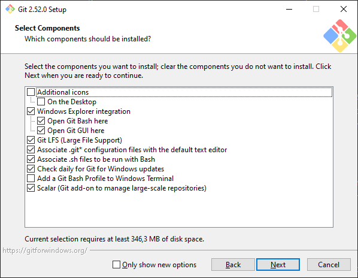

Den standartmäßigen Text-Editor kann ebenfalls frei gewählt werden.
Ich empfehle Nano zu benutzen, weil die Benutzeroberfläche einfach ist und man (nicht wie bei Vim) sofort drauf los schreiben kann oder irgendeinen anderen den du schon installiert (und benutzt) hast.
(Speichern: Strg + O, Schließen (speichert nicht): Strg + X)

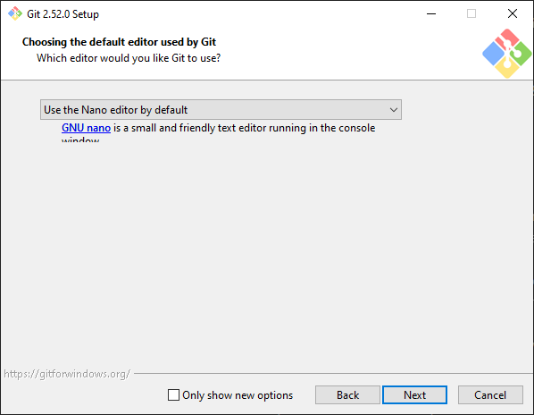

Der standartmäßigen Branch-Name  kann ebenfalls frei entschieden werden.
Unser Repository benutzt "main", wird aber von dieser Einstellung nicht beeinflusst.

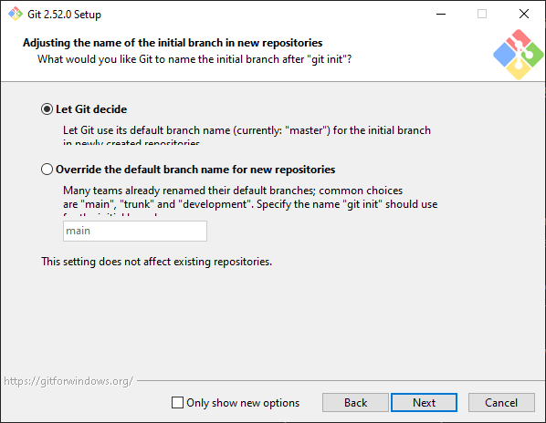

PATH-Environment Einstellung sollte so gelassen werden, außer du weißt was du tust.

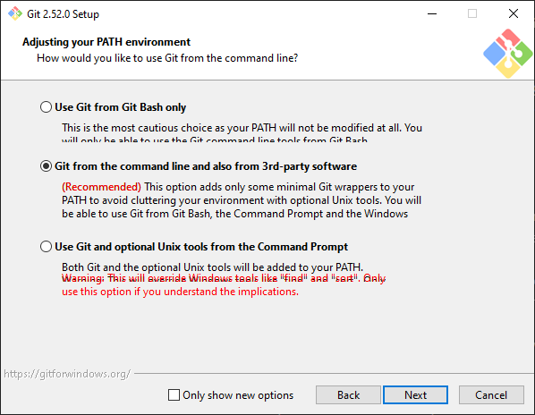

SSH-Executable Einstellung sollte auch so gelassen werden, außer du weißt was du tust.
(Beeinflusst unser Vorhaben nicht)

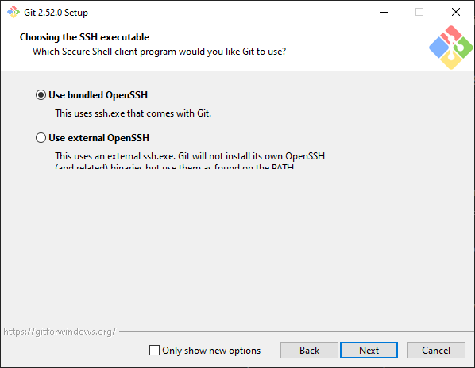

HTTPS transport backend Einstellung sollte ebenfalls so gelassen werden, außer du weißt was du tust.

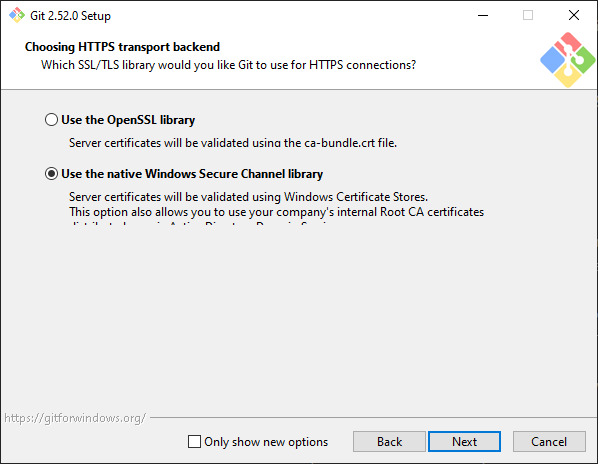

Die Line Ending Convention Einstellung kann frei gewählt werden, wir empfehlen aber sie so zu lassen.

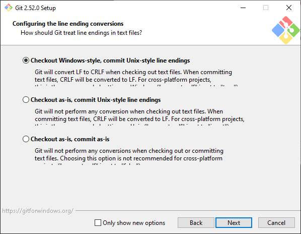

Die Terminal Emulator Einstellung kann frei gewählt werden, wir empfehlen die MinTTY

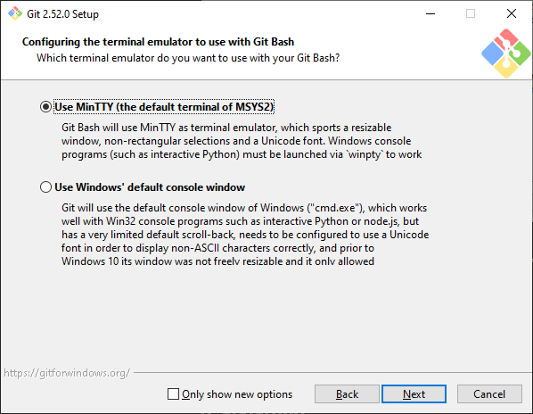

Die default git pull Einstellung sollte so gelassen werden, außer du weißt **wirklich** was du tust.

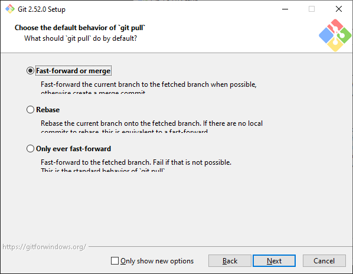

Die Git Credential Helper Einstellung kann frei entschieden werden.

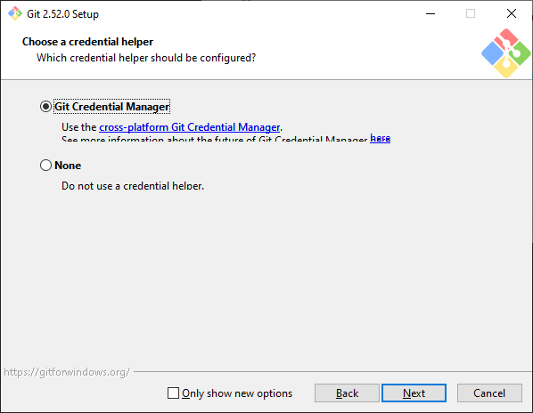

Die Extra Options können ebenfalls frei gewählt werden, wir empfehlen sie so zu lassen.

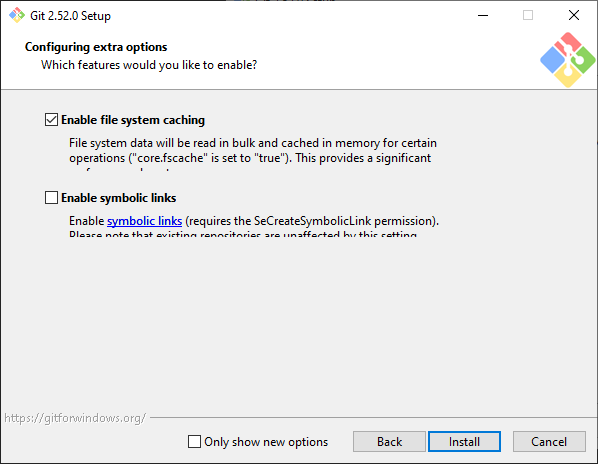

Nun auf installieren und warten bis es fertig ist.

Und fertig! (Mit der Installation)

---

### Setup

Jetzt wo Git installiert ist, können wir im nächsten Schritt das Repository auf dein Gerät laden.

Dafür öffnen wir "Git CMD" (oder welches terminal du gewählt hast) und werden von diesem Fenster begrüßt

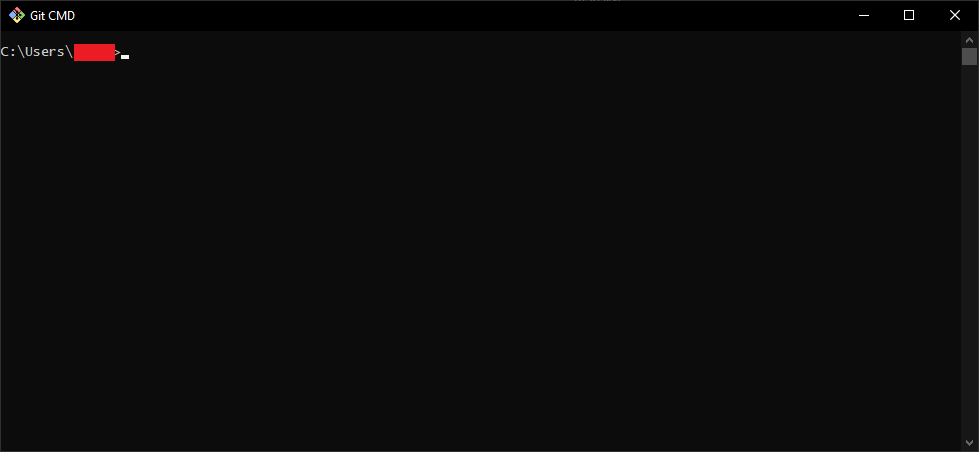

Jetzt navigieren wir zu dem Ordner in dem du die Notizen speichern möchtest.

``` bash
cd <your>/<folder>/<path>/<here>/
```


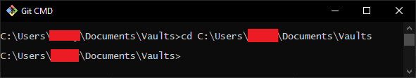

Holen uns den Link zum [Repository](https://github.com/Ph03nixF34ther/Lerngruppe.git) (https://github.com/Ph03nixF34ther/Lerngruppe.git) 

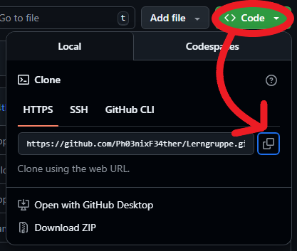

Und klonen es mit

``` bash
git clone https://github.com/Ph03nixF34ther/Lerngruppe.git
```


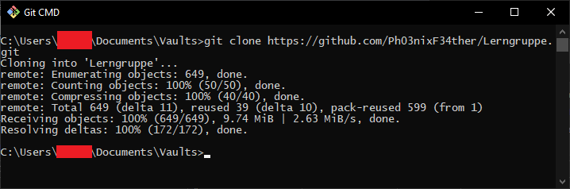

Und Fertig (mit dem git) wenn du nur Lesen und Lernen möchtest.

Willst du auch beitragen, siehe Abschnitt: [Beitragen](#beitragen).

---

### Updaten

Wir werden das Repository (höchstwahrscheinlich) kontinuierlich updaten und diese Updates müssen manuell heruntergeladen werden.

Dafür öffnen wir wieder Git CMD (oder dein gewähltes Terminal) und navigieren zum Speicherort und updaten es mit

``` bash
git pull origin main
```

Dieser Befehl setzt sich zusammen aus:
- pull: Lade die neusten Veränderungen herunter und wende sie auf meine lokal gespeicherte Version an
- origin: Der Ort, wo das Git-Repository herkam (Das Remote Repository auf GitHub)
- main: Die Branch die du haben möchtest

Jetzt gibt es zwei Fälle:

#### Alles funktioniert wie es soll

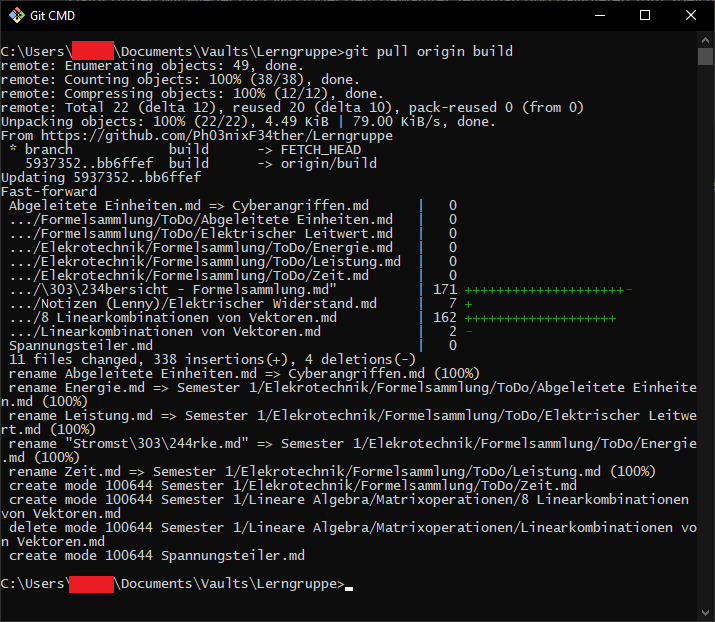

Der Git-Pull funktioniert wie geplant und du bist fertig

#### Oh nein es beschwert sich

// TODO

---

(**Optional**)

### Beitragen

**(Dafür müsst ihr Eingeladen werden: Den Owner fragen)**

Wir bewegen uns in den Ordner der Lerngruppe, wieder mit

``` bash
cd <your>/<file>/<path>/<here>/Lerngruppe
```


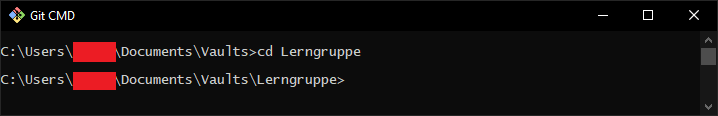

Und wechseln die Branch auf "build"

``` bash
git checkout build
git pull origin build
```


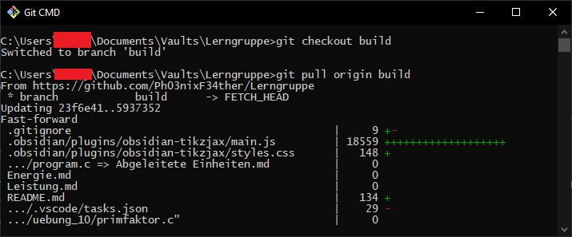

Auf diesen Branch kann man Änderungen pushen und einen Pull Request beantragen, um diese in den main branch aufzunehmen.


## Obsidian

### Installation

Folge dem [Link]([https://obsidian.md/](https://obsidian.md/download)) und wähle die für dich passende Version aus

// TODO

# To-Do-Liste

# Termine
