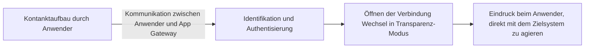

## Schutzmodule einer Firewall

### Sicherheitsmanagement

- In der Grafik außerhalb von allem anderen, Abkapselung darzustellen

### Integritätstest

- Testet ob alles so aussieht wie es soll (z.B. mit Checksums)
	- Betriebssystem
	- Firewall
	- Sicherheitsmechanismen

### Authentisierungsmodul

- Schutz des Regelwerks und der Logfiles vor unberechtigten Zugriffen
- Zugriff nur über das Sicherheitsmanagement von autorisierten Benutzern

## Aktive Elements einer Firewall

- Arbeitsweise der Firewall ist abhängig von dem aktiven Firewall-Element
- Einbindung der Firewall auf unterschiedlichen Kommunikationsebenen
- Prüfinformationen vom Regelwerk

### Packet-Filter

- Analysiert nd kontrolliert die ein- und ausgehenden Pakete auf der...
	- Transportschicht
	- Netzzugangsschicht
	- Internetschicht
- Packet-Filter verhalten sich woe eine Netzwerk-Bridge
- Empfangene Pakete werden aufgenommen und analysiert
- Packet-Filter sind nicht nur auf TCP/IP-Protokolle beschränkt

#### Arbeitsweise

- Interpretation des Paketinhalts
- Verifizierung des Header-Inhalts mit definierten Regeln für jeweilige Kommunikationsebenen
- Die Definition der Regeln ist i.d.R. so, dass nur notwendige Kommunikation erlaubt ist
- Bekannte sicherheitskritische Einstellungen werden vermieden (Bspw. IP-Fragmentierung)

// TODO Bild aus Präsentation

#### Vorteile und Möglichkeiten

- Transparent für Nutzer und Netzwerkteilnehmer
- Benötigen keine aktiven Einwirkungen des Anwenders
- Flexibel erweiterbar für unterschiedliche Protokolltypen
- Leicht realisierbar, da geringe Komplexität
- Hohe Performance durch optimale Mechanismen

#### Nachteile und Grenzen

- Paket-Filter können Struktur des zu schützenden Netzwerks nicht verbergen
- Protokolldaten werden nur bis zu Transportschicht zur Verfügung gestellt
- Möglichkeiten der Nutzung von falsch programmierten Programmen innerhalb des zu schützenden Netzwerks bei erlaubten Kommunikationsverbindungen
- Kein Schutz für Anwendungen wie FTP, HTTP, SMTP etc.

### Zustandsorientierte Packet-Filter

- Normaler Packet-Filter erweitert durch Analyse-Tools auf höheren Netzwerkschichten
- Statusinformationen der Pakete werden in Zuständen festgehalten
	- "Stateful-Inspection Firewall"
	- Meist zu Komplex um alle Use-Cases zu berücksichtigen, Protokolle werden immer weiterentwickelt und es kommen immer wieder neue dazu
	- Ist laut ISO/OSI nicht die Aufgabe dieser Schicht

#### Vorteile und Möglichkeiten

- Transparent für Anwender und IT-Systeme
- Theoretisch flexibel anpassbar
- Für mehrere Protokolle anwendbar

#### Nachteile und Grenzen

- Komplexität steigt mit Funktionsumfang
- Netzwerkstruktur wird nicht verborgen
- Falsch konfigurierte Programme können von außerhalb gesteuert werden, wenn Kommunikation erlaubt ist

### Application Gateway

- Logische und physische Entkopplung der Netzwerke
- Realisierung meist als "Dual-Homed Gateway" mit zwei Netzwerkanschlüssen
- IT-System mit dem App-Gateway wird als **Bastion** bezeichnet
	- Dies ist der einzige Zugang vom unischeren in das sicher Netz
	- Sie ist der wertvollste Bestandteil des IT-Systems und muss besonders geschützt werden

// TODO Bild aus Präsentation

#### Arbeitsweise

#### Ansatz

- Auf Netzzugangsschicht werden Pakete an unterschiedlichen Ports empfangen
- Erlauben von bestimmten Diensten und Weiterleitung von entsprechenden 

#### Proxy

- Vorhalten von weiteren Sicherheitsdiensten innerhalb des Proxys
- Intensive Analyse der Pakete möglich, da Kontext der Daten klar definiert ist
- Umfangreiche Sicherungs- und Protokollierungsmöglichkeiten
- Kleine überschaubare Module reduzieren Fehleranfälligkeit der Proxy-Software

// TODO Bild aus Präsentation

#### Anwendung

- Für jeden erlaubten Dienst ist ein spezieller Proxy notwendig
- Kein Proxy -> keine Übertragung
	- Sicherstellung notwendig, dass Daten nicht anderweitig Übertragen werden
- So wenig Software wie möglich auf einem App-Gateway
	- Gefahr des Ausnutzens von Fehlern oder Lücken einer anderen Software zur Übertragung

#### Vorteile und Möglichkeiten

- Sicheres Design-Konzept, da kleine, gut überschaubare Module verwendet werden
- Alle Pakete müssen über Proxy übertragen werden, daraus resultiert höher Sicherheit
- Echter Kommunikationspartner des unischeren Netzes ist der Proxy, dadurch Entkopplung der Dienste
- Interne Netzwerkstruktur wird verborgen
- Network Address Translation findet statt

#### Nachteile und Grenzen

- Geringe Flexibilität, da für neue Dienste neue Proxys notwendig sind
- Kosten für App-Gateway sind höher als für Packet-Filter
- Erhöhter Aufwand bei verschlüsselter Kommunikation
	- Ent- und Verschlüsselung der Pakete notwendig
	- Eigene Zertifikate notwendig

## Designkonzepte einer Firewall

- Wie sollte eine Firewall beschaffen sein?
	- Minimaler Umfang an Software
		- Klare Logiken und nachvollziehbare Struktur der Software
		- Firewall-Software sollte fehlerfrei sein
			- Umso komplexer, umso fehleranfälliger wird eine Software
		- Verwendung von nur für die Einbringung der Firewall-Funktionalität unbedingt notwenigen Programmen
	- Einfache und berechtigte Bedienung des Sec-Managers
		- Einfache und zuverlässige Bedienung des Security-Managements erforderlich
			- Regeln sollten fehlerfrei eingegeben werden
			- Hohe Komplexität verleitet zu Faulheit oder Oberflächlichkeit
		- Autorisierung und Identifikation notwendig
			- Festlegen von Berechtigungen zum Ändern und Einsehen der Regeln
		- Prüfen der Widersprüche der Regeln
			- Vermeidung von sich gegenseitig aufhebenden Regeln
	- Getrenntes Security Management
		- "Minimale Software" bedingt, dass das Security Management von den Sicherheitsunktionen des aktiven Firewall-Elementes getrennt realisiert werden muss
		- Keine Möglichkeit schaffen, von außen auf Sicherheitsmanagement zuzugreifen
		- Realisierung auf einem separatem IT-Systeme innerhalb des sicheren Netzwerks
	- Sichere Einbindung in Kommunikationssystem
		- Sicherheit der Firewall hängt maßgeblich davon ab, wie gut die Sicherheitsmechanismen in das Kommunikationssystem eingebunden werden
		- Firewall-Funktion dürfen nicht umgehbar oder aushebelbar sein

## Next-Gen-Firewalls

- Analyse-Module können unterschiedliche Anwendungsdaten in einem Datenstrom unabhängig von der Portnummer erkenne und entsprechend filtern
- Beispiel
	- Kontrolle des HTTP-Protokolls (Port 80)
		- Websiten verwenden 
- Herkömmliche Firewalls können Angriffe durch Port-Hopping nicht verhindern oder erkenne
	- Setzt voraus, dass ungenutzte Ports offen bleiben
- Im Fall eines geblockten Ports wechselt
- Identifikation von Anwendungen
- Wesentliche Funktion einer Next-Gen-Firewall
	- ermöglicht Administration mehr Kontrolle
- Zuordnung von Nutzern und Datenströmen
	- Vorteil der Nutzerkennung ist, dass den Nutzern Rollen und Gruppenzugehörigkeiten zugeordnet werden können

# Linux-Systeme

Folien schon Vorhanden