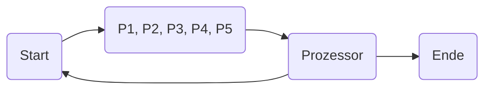
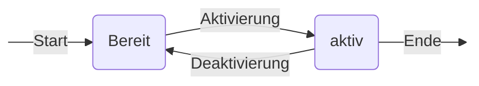
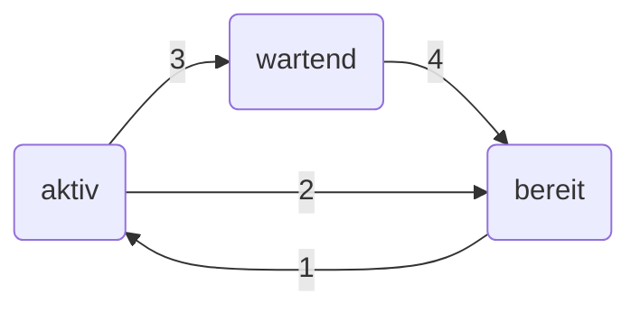
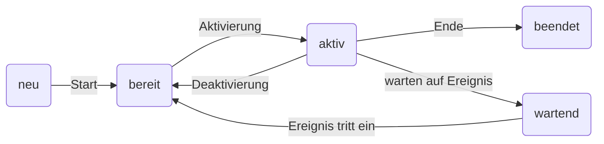

# Allgemein

- konzeptionelles Modell, das den Umgang mit Parallelität vereinfacht
- erleichtert Beschreibung von Prozessen und deren Synchronisation
- hilft, sich  Abläufe innerhalb eines Systems darzustellen

# Einfaches Prozessmodell

# Erweitertes Prozessmodell

# Zustandsänderung

- ausführen
	bereit $\longrightarrow$ aktiv
- verdrängen
	aktiv $\longrightarrow$ bereit
- blockieren
	aktiv $\longrightarrow$ wartend
- aufwecken
	wartend $\longrightarrow$ bereit