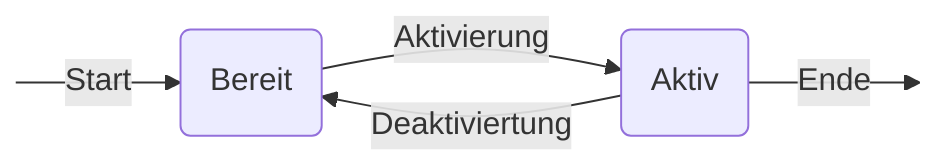

(*J*unction *F*ield *E*ffect *T*ransistor)

![[JFET_unbeschaltet_labled.png|300]]

# Aufbau und Steuerung

![[JFET_beschaltet_labled.png|300]]

![[JFET_sperrbeschaltet_labled.png|300]]
# Symbole

```tikz
\usepackage{circuitikz}
\begin{document}
\begin{tikzpicture}[transform shape]
	% Paths, nodes and wires:
	\node[shape=rectangle, minimum width=4.215cm, minimum height=0.465cm] at (9.25, 8){} node[anchor=north west, align=left, text width=3.827cm, inner sep=6pt] at (7.125, 8.25){p-Kanal JFET};
	\node[shape=rectangle, minimum width=4.215cm, minimum height=0.465cm] at (9.375, 6){} node[anchor=north west, align=left, text width=3.827cm, inner sep=6pt] at (7.25, 6.25){n-Kanal JFET};
	\node[njfet] at (7, 8.02){};
	\node[pjfet] at (7, 6){};
\end{tikzpicture}
\end{document}
```


