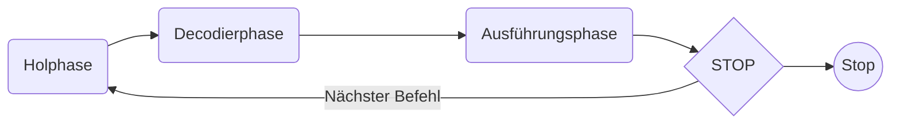

# Grundlagen der Informationsverarbeitung

## Das EVA-Prinzip

Eingabe → Verarbeitung → Ausgabe.

Eingabe:
Programme werden mit Werten (Daten, Programmen, Kommandos) versorgt.

Verarbeitung:
Die Verarbeitung der Eingabedaten geschieht in der Zentraleinheit. Dabei steuern die aktiven
Eingabedaten (Programme) die Verarbeitung der passiven Eingabedaten.

Ausgabe:
Die Ausgabe ist ein Vorgang, durch den eine Rechenanlage Programme oder errechnete Daten an
die Außenwelt abgibt. 

## Prozesse

>[!Definition] Definition
>Ein Prozess ist der Vorgang einer algorithmisch ablaufenden Informationsverarbeitung.

Eigenschaften von Prozessen:
- Sie laufen in der Regel geordnet ab, das heißt, sie werden gestartet, überwacht und beendet.
- Prozesse können unterbrochen werden und zu späteren Zeitpunkten fortgesetzt werden.
- Prozesse können durch andere Prozesse beeinflusst werden.
- Prozesse werden durch einen Prozessor ausgeführt.
- Prozesse können gleichzeitig oder nacheinander ablaufen.
- Mehrere Prozesse können zu einem Prozess zusammengefasst werden.
- Prozesse können aufgespalten (fork) und wieder zusammengeführt (join) werden.

## Informationen

Daten (Einzahl: Datum) sind Ordnungs- oder Mengeninformationen

Aktive Daten steuern die Arbeit von Computern. 
Passive Daten sind Daten, die dem jeweiligen Verarbeitungsprozess unterworfen sind.

Eine Information besteht aus:
- einem syntaktischen Teil, der die zulässige Struktur der Bausteine beschreibt, aus denen sich die Information zusammensetzt,
- einem semantischen Teil, der die Bedeutung der Information angibt und
- einem pragmatischen Teil, aus dem sich der Zweck der Information und die erhoffte Reaktion ergeben.

# Informationsdarstellung und -speicherung

## Datenklassifikation

### Logische Datenhierarchie

``` mermaid
graph LR
    A(Zeichen) --> B(Begriff)
    B --> C(Satz)
    C --> D(Datei)
    D --> E(Datenbank)
````

>[!Important] Wichtig
>Das Bit ist die kleinste unteilbare informationstechnische Einheit.

``` mermaid
graph LR
	A(Bit) --> B(Byte)
	B --> C(Block)

```

Byte:
das Byte als die kleinste adressierbare Einheit im Speicher

Block:
er Block als eine fortlaufende Folge von Bytes, die als Einheit gelesen oder geschrieben werden kann. Die Länge von Blöcken ist von verschiedensten Faktoren abhängig (Hardware, Betriebssystem usw.).

## Codierungen

Allgemein gesprochen ist ein Code ein Schlüssel zum Verstehen eines Zeichens
Beispiel: ASCII (American Standard Code for Information Interchange), EBCDI-Code (extended binary coded decimal interchange code) 

## Darstellung numerischer Daten

### Darstellung negativer Zahlen
Die Darstellung negativer Zahlen erfolgt meist durch die Zweierkomplementdarstellung

>[!Important] Das Zweierkomplement
>Das Zweierkomplement wird gebildet, indem;
> 1. Die Zahl invertiert wird (jede 1 wird zu einer 0 und jede 0 zu einer 1)
> 2. Die Zahl wird um 1 erhöht

### Das Gleitpunktverfahren

Über das Gleitunktverfahren können reele Zahlen unterschiedlich genau dargestellt werden.
Dabei wird die Zahl mathematisch aufgeteilt:
$$
z = vz \cdot m \cdot 2^{e}
$$

Relevant sind also Vorzeichen, Mantisse und Exponent, die wie folgt gespeichert werden:

$$
\begin{array}{r|c|l}
\underbrace{ 1 }_{ \text{VZ} } & \underbrace{ 11000100000000000000000000 }_{ \text{Mantisse} } & \underbrace{ 100100 }_{ \text{Exponent} }
\end{array}
$$
Wichtig zu beachten ist, dass der Exponent auch negativ sei kann. Um dabei kein Zweierkomplement nutzen zu müssen,  wird $32$ zum Exponent dazugezählt. 

Multiplikation

$$
z_{1} \cdot z_{2} = m_{1} \cdot m_{2} \cdot 2^{e_{1} + e_{2}}
$$
Addition:
Bei verschiedenen Exponenten muss die jeweis größere Zahl auf den Exponent der Größeren umgerechnet werden.
Dafür muss die um die $e_{1} - e_{2}$ Stellen nach rechts verschoben werden.


# Boolsche Algebra

Rechengesetze der boolschen Algebra:

$$
\begin{array}{l l | r}
(I) & X \land (Y \land Z) = (X\land Y) \land Z & \text{Assoziativgesetz} \\
(II) & X \lor (Y \lor Z) = (X\lor Y) \lor Z  \\
(III) & X \land Y  = Y \land X & \text{Kommutativgesetz} \\
(IV) & X \lor Y  = Y \lor X\\
(V) & X \land (X \lor Y) = X & \text{Absorbtionsgesetz} \\
(VI) & X \lor (X \land Y) = X \\
(VII) & X \land (Y \lor Z) = (X \land Y) \lor (Y \land Z) & \text{Distributivgesetz} \\
(VIII) & 0 \land X = 0 & \text{neutrale Elemente} \\
 & 0 \lor X = X \\
 & 1 \land X = X \\
 & 1 \lor X = 1
\end{array}
$$

Obwohl sich einiges Wiederholt haben wir dann Rechengesetze aufgestellt

$$
\begin{array} {ll}
(I)    & \overline{\overline{A}} = A \\
(II)   & A \land A \land A \land \dots \land A = A \\
(III)  & A \lor A \lor A \lor \dots \lor A = A \\
(IV)   & \overline{A} \lor A = 1 \\
(V)    & \overline{A} \land A = 0 \\
(VI)   & A \land 0 = 0 \qquad A \land 1 = A \qquad A \lor 0 = A \qquad A \lor 1 = 1 \\
(VII)  & A \lor B = B \lor A \qquad A \land B = B \land A \\
(VIII) & A \land (B \land C) = A \land B \land C \\ 
 & A \lor (B \lor C) = A \lor B \lor C \\
(IX)   & A \land (B \lor C) = (A \land B) \lor (A \land C) \\
 & A \lor (B \land C) = (A \lor B) \land (A \lor C) \\  \\
\hline \\
(X)    & A \land (B \lor A) = A \\
 & A \lor (B \land A) = A \\
(XI)   & \overline{A \land B} = \overline{A} \lor \overline{B} \\
 & \overline{A \lor B} = \overline{A} \land \overline{B} \\
(XII)  & \text{Trivial, da wie (XI)} \\
(XIII) & \text{Trivial, da wie (IX)} \\
(XIV)  & (A \land B) \lor (A \land \overline{B}) = A \\
(XV)   & (A \lor B) \land (A \lor \overline{B}) = A \\
(XVI)  & A \lor (\overline{A} \land B) = A \lor B \\
(XVII) & A \land (\overline{A} \lor B) = A \land B 
\end{array}
$$

## Sondergestellte Boolsche Operationen

### Implikation

| A   | B   | $A\implies B$ |
| --- | --- | ------------- |
| 0   | 0   | 1             |
| 0   | 1   | 1             |
| 1   | 0   | 0             |
| 1   | 1   | 1             |

### Äquivalenz

| A   | B   | $A \iff B$ |
| --- | --- | ---------- |
| 0   | 0   | 1          |
| 0   | 1   | 0          |
| 1   | 0   | 0          |
| 1   | 1   | 1          |
### Antivalenz

| A   | B   | $A \nsim B$ |
| --- | --- | ----------- |
| 0   | 0   | 0           |
| 0   | 1   | 1           |
| 1   | 0   | 1           |
| 1   | 1   | 0           |

# Komponenten und Aufbau eines digitalen Rechners

## Die von-Neumann-Architektur

![[Von-Neumann-Architektur.svg]]

- Vor Beginn einer Verarbeitung zur Lösung eines Problems muss ein Verarbeitungsvorschrift (Programm) eingegeben werden.
- Programme und Daten werden im gleichen Speicher abgelegt.
- Der Speicher ist in gleich große, fortlaufend nummerierte Zellen eingeteilt.
- Aufeinanderfolgende Befehle werden in physisch aufeinanderfolgenden Speicherzellen abgelegt.
- Durch Sprungbefehle kann von der durch die physische Speicherung vorgegebenen Reihenfolge abgewichen werden.
- Es gibt mindestens Befehle für:
	- arithmetische Operationen,
	- Transportbefehle,
	- logische Befehle,
	- bedingte Sprünge sowie
	- sonstige Befehle (Ein- / Ausgabebefehle, Warte-Befehle, Verschieben, …).
- Daten und Befehle sind binär codiert.

Alle arithmetischen Funktionen können auf Addition, Bitverschiebung und die Komplementbildung zurückgeführt werden.
### Zentraleinheit


Prozessoren sind die aktiven Elemente eines Computers und unterteilen sich in Steuerwerk,
Rechenwerk und weitere Register.

>[!Important] Zentraleinheit
>Die Zentraleinheit ist das Hauptelement jedes Computers. Unter Steuerung des Betriebssystems werden hier die zentralen Steuer-, Rechen- und Speichervorgänge ausgeführt. Die Zentraleinheit beinhaltet einen oder mehrere Prozessoren und den Hauptspeicher (auch Arbeitsspeicher).

### Der Akkumulator

>[!Important] Akkumulator
>Der Akkumulator ist ein spezielles Register des Rechenwerks. Im Akkumulator werden vor der Ausführung von Operationen die Operanden und nach deren Ausführung Zwischenergebnisse gespeichert, die dann sofort weiterverarbeitet werden können.

### Das Steuerwerk

Das Steuerwerk (auch Leitwerk) ist eine zentrale Komponente eines Prozessors. Es lädt, dekodiert und interpretiert die auszuführenden Befehle und versorgt die beteiligten Funktionseinheiten mit den nötigen Signalen.

Die Befehlsausführung kann durch folgenden Befehlszyklus grob beschrieben werden.



1. Transport des nächsten Befehls aus dem Speicher ins Steuerwerk
2. Entschlüsseln und Interpretieren des Befehls
3. Erzeugung von Steuersignalen zur Ausführung des Befehls (z. B. durch Mikroprogramme) 

Die Zeit, die ein Prozessor für den Durchlauf dieses Zyklus benötigt, wird als Zykluszeit bezeichnet

### Der Speicher

Das Speicherwerk hat die Funktion, alle für die Verarbeitung erforderlichen Daten und Befehlsfolgen (Programme) zu speichern. Das Speicherwerk besteht aus dem sogenannten Arbeitsspeicher und dem Festspeicher.
Der Arbeitsspeicher (auch Hauptspeicher) besteht aus einzelnen Speicherzellen, die frei zugänglich sind. Vier wesentliche Aufgaben charakterisieren diese Speicherzellen.

1. Zeichen können in die Speicherzellen geschrieben werden.
2. Der Speicher hält diese Zeichen für eine bestimmte Zeit fest.
3. Die Zeichen können wieder ausgegeben werden.
4. Vorhandene Zeichen können durch andere ersetzt werden.

Im Festspeicher werden Programme und Daten gehalten, die nicht überschrieben werden sollen. Solche Programme und Daten werden für interne Aufgaben, die ständig innerhalb des Systems bearbeitet werden müssen (z.B. Startroutinen und Basisfunktionalitäten) verwendet. Weiterhin zählen zum Speicherwerk noch die Pufferspeicher, die auch als Cache bezeichnet werden.

## Speicherung und Adressierung

Adressraum:
Der Adressraum ist die Menge aller möglichen Adressen. Seine Größe ist vom gegebenen Betriebssystem, dem vorhandenen Speicher und dem Prozessor abhängig.

Speicherraum:
Die Menge aller Adressen, die im physisch vorhandenen Hauptspeicher vorkommen, wird als Speicherraum bezeichnet.

Symbolische Adressierung:
Bei der symbolischen Adressierung wird einer Speicherzelle ein frei wählbarer Name zugeordnet. Diese Adressierungsart wird vor allem bei der Programmierung. Während eines Programmlaufs werden symbolische Adressen dann durch konkrete (absolute) Speicheradressen ersetzt.


Realer Hauptspeicher:
Als Realer Hauptspeicher eines Rechnersystems wird der in das System eingebaute RAM (Random
Access Memory) bezeichnet.

Virtueller Hauptspeicher:
Viele moderne Betriebssysteme sind durch die verwendeten Adressformate potenziell in der Lage, sehr große Adressräume zu bilden. Die Größe des adressierbaren Speichers liegt bei diesen Systemen im Gigabyte-Bereich und mehr. Um aber einen möglichst großen Adressraum nutzen zu können, werden Hintergrundspeicher verwendet. Der so entstehende vergrößerte Arbeitsspeicher wird virtueller Speicher genannt. Dies ist möglich, weil insbesondere bei Multitasking- und Multiusersystemen nicht alle Daten gleichzeitig benötigt und damit im Hauptspeicher gehalten werden müssen.

Die den virtuellen Adressen entsprechenden physischen Adressen des Hauptspeichers vergibt das Betriebssystem oder eine spezielle Hardwarekomponente, die Memory Management Unit (MMU), das/die auch das Laden und Auslagern der Seiten ausführt.


## Ein- und Ausgabewerke

Interne Datenübertragung:
Die interne Übertragung von Daten innerhalb eines Rechners geschieht über das sogenannte
Bussystem. Ein Bus ist eine Sammelleitung zur Datenübertragung zwischen mehreren Funktionseinheiten eines Rechners. 
Ein Bus wird verwendet, da es in der Praxis zu aufwendig ist die einzelnen Leiterbahnen zu ziehen. 

Die Steuerungslogik (Buscontroller) sorgt dafür, dass lediglich ein Gerät zu einer bestimmten Zeit Informationen über den Bus senden kann. Die Busstruktur wird häufig als Adressbus und als Datenbus eingesetzt. 

Bei einem Adressbus werden Signal vom Prozessor an Speicher- oder Peripheriegeräte übertragen.
Der Datenbus hingegen ermöglich den Datenverkehr zwischen verschiedenen Funktionseinheiten eines Computers
Die mögliche Anzahl Bits, die gleichzeitig über einen Bus übertragen werden können, wird auch als Busbreite bezeichnet.

Geräteverwaltung (EA-System):
Das EA-System wird verwendet um die verschiedenen Geräte in einem Computer zu steuern. 
Bei der einfachsten Form eines EA-Systems sind die Geräte direkt an die Zentraleinheit angeschlossen und laufen unter der Kontrolle des Hauptprozessors. 
In der Regel ist allerdings der Hauptprozessor sehr viele schneller als das Ausgabegerät. Das heißt, dass der Hauptprozessor sehr viel Zeit damit verbringen würde, auf die Ein- und Ausgabegeräte zu warten. Deshalb besitzen Rechenanlagen häufig spezielle EA-Prozessoren, auch Kanäle genannt, die der Zentraleinheit die Bedienung der externen Geräte abnehmen. 
Kanäle werden zwischen die Zentraleinheit und die Geräte geschaltet. Jeder dieser Kanäle kann als selbständig arbeitende Rechenanlage mit Spezialaufgaben angesehen werden, die von der Zentraleinheit mit Aufträgen versorgt wird. 
Ablauf:
- Die Zentraleinheit sendet dem Kanal:
	- den Typ des gewünschten Gerätes
	- die Adresse eines Kanalprogramms
	- die Startadresse und die Länge des Hauptspeicherbereichs, der ausgegeben werden soll, bzw. in den die Daten bei einer Eingabeoperation gebracht werden sollen
- Der Kanal holt sich jetzt selbständig die Daten aus dem Hauptspeicher der Zentraleinheit und sorgt für deren ordnungsgemäße Ausgabe (oder umgekehrt bei Eingabeoperationen)

Das Kanalprogramm hat diese Aufgaben:
- Auswahl des Gerätes
- Anpassung des Datenstroms von der Zentraleinheit an den Code des Ausgabegerätes mit hilfe des Gerätetreibers
- Synchronisation der Zugriffe auf den Hauptspeicher
	- Verzögerung des Zugriffs der Zentraleinheit auf den Hauptspeicher, wenn der Kanal darauf zugreift (cycel stealing)

Ein Kanal besitzt i.d.R. vier Register. Das EA-Register dient als Zwischenspeicher für die zu übertragenden Daten. Mit Hilfe des Kontrollregisters wird das entsprechende Gerät spezifiziert und es kann Fehlerinformationen über den Kanal und das Gerät enthalten. Das Adressregister enthält die Hauptspeicheradresse des nächsten, aus dem Hauptspeicher zu übertragenden, Datums und der Längenzähler enthält die Anzahl der noch zu übertragenden Daten. Erreicht der Längenzähler den Wert 0, so ist die EA-Operation beendet. Jetzt wird das Kontrollregister mit den Kontrollinformationen über den Ausgang der EA-Operation belegt. 

Es gibt zwei Arten von Kanälen, Multiplexkanäle, die gleichzeitig eine Menge relativ langsamer Geräte versorgen und Selektorkanäle, die nur ein angeschlossenes schnelles Gerät versorgen und während der gesamten EA-Operation mit dem Gerät verbunden bleiben.

Gerätesteuerungen, auch Controller genannt, setzen die Steuersignale des Kanals in echte Aktionen des Gerätes um, wie z.B. Bewegung der Lese-/Schreibköpfe bei Plattengeräten, Papiertransport bei
Druckern usw.
Pufferungstechniken bewirken, dass die Daten in einem Bereich im
Hauptspeicher, dem Puffer, gehalten werden, bis dieser voll ist. Anschließend werde die Daten in einem Block zum Gerät gesendet. 

An eine Rechenanlage können Geräte angeschlossen werden, die von mehreren Programmen gleichzeitig benutzt werden können.

Spooling(simultaneous peripheral operations on line) ist ein verfahren, bei dem Ausgabeaufträge für Geräte die nur einenAuftrag gleichzeitig ausführen können, vormerkt und erst ausführt wenn das Gerät entsprechende Gerät frei ist.  Die Daten werden in einer Spooler-Ausgabedatei gesammelt und über spezielle Spool-Ausgabeprogramm ausgegeben. Eingaben werden in einer Spooler-Eingabedatei gesammelt, aus der ein beliebiges Programm bei Bedarf die Daten abruft. In beiden Fällen ist für dieses Programm nicht zu unterscheiden, ob die Daten direkt von einem Gerät kommen oder direkt an ein Gerät abgegeben werden oder ob sie vom Spool-System bereitgestellt oder in Empfang genommen werden.


# Softwarekomponenten

## Betriebssysteme

Alle Programme, die die Ausführung von Benutzerprogrammen, die Verteilung der Betriebsmittel und die Aufrechterhaltung der Betriebsart steuern, werden zusammenfassend als Betriebssystem bezeichnet. Die Gesamtstruktur eines Betriebssystems gliedert sich dabei in Organisationsprogramme, Übersetzungsprogramme und Dienstprogramme.

Organisationsprogramme dienen der Verwaltung der zur Verfügung stehenden Ressourcen.
Zu ihr gehören:
- Speicherverwaltung
- Prozessorverwaltung
- Geräteverwaltung
- Kommunikation

Übersetzungsprogramme übersetzen Programme höherer Programmiersprachen in auf einem
Rechner ausführbaren Programmcode.
Zu ihr gehören:
- Interprete
- Compiler (Übersetzer)

Dienstprogramme sind Programme zur Lösung von Standardproblemen, wie Schreiben und Bearbeiten von Dateien oder Sortieren von Dateien.

## Anwendungsprogramme

Die Programme, die die Endnutzer (Anwender) eines Computers einsetzen, heißen
Anwendungsprogramme. Als Anwender wird eine Person oder Institution bezeichnet, die zur
Lösung oder Wahrnehmung ihrer Aufgaben die elektronische Datenverarbeitung nutzt. Dem
gegenüber stehen die Benutzer (der Nutzer/user), die unmittelbar Kontakt zur Rechenanlage haben.